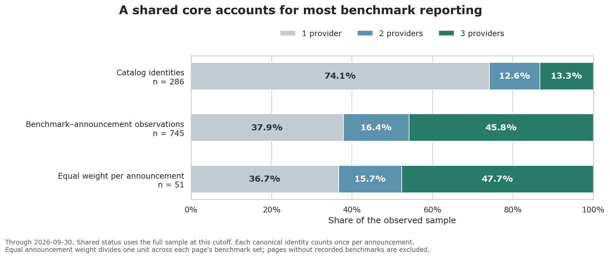
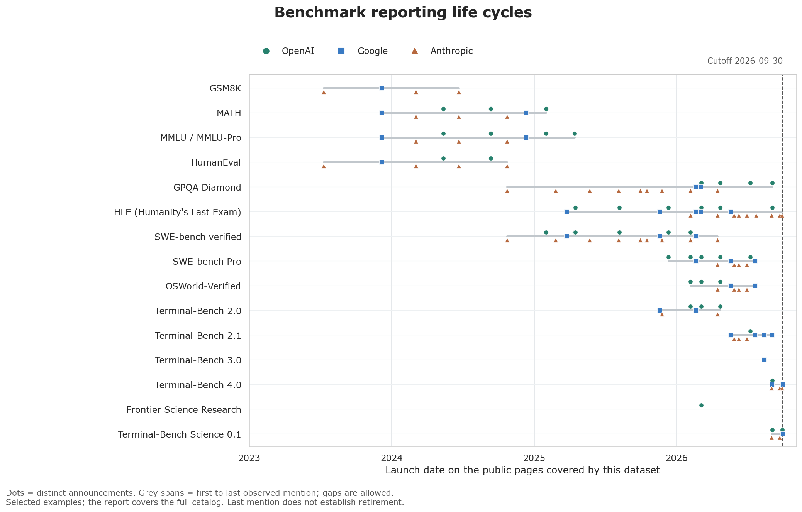
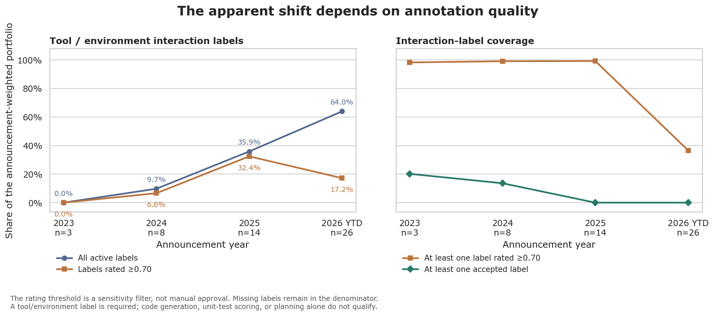

<!-- Generated by analysis/project_overview/analyze.py. Edit README.template.md, then run scripts/run_pipeline.sh. -->
# The Evolution of Benchmarks in Frontier Models

**A source-linked history of the evaluations named in OpenAI, Google, and Anthropic model announcements.**

[](https://github.com/isingmodel/evolution_of_benchmarks_in_frontier_models/actions/workflows/ci.yml)
[](#the-sample)
[](LICENSE)

Which benchmarks become shared reference points, how often do they return, and
how does the mix of tasks represented by those evaluations change? This project follows those questions
through public launch pages, with a canonical catalog, source-linked reporting
histories, and reproducible analyses.

The clearest result is **concentration inside a diverse catalog**: only
**25.9% of observed benchmark identities appear across providers**, yet
they account for **62.1% of benchmark–announcement observations**.
The taxonomy also suggests a shift toward tool and environment interaction,
but incomplete annotation review limits how precisely that shift can be measured.

**59 model rows · 55 distinct announcements · 745 canonical announcement observations · 286 observed identities**

The measured outcome is **public reporting**. A benchmark name may appear in a
result table, footnote, suite-component list, comparison, or partner quotation.
Appearance alone does not establish a score for the new model, prominence on the
page, or use during training.

[Explore each benchmark](analysis/benchmark_lifecycle/report.md) ·
[Inspect the evidence tables](analysis/project_overview/README.md) ·
[Reproduce the project](#reproduce-and-extend)

## 1. A small shared set accounts for most reporting

**74 of 286 observed identities** appear on announcements from at least two
providers; **38** appear across all three. Most identities remain specific
to one provider in this sample, while shared benchmarks recur much more often.



The result survives a change in weighting. Giving each benchmark-bearing
announcement one unit, divided across its benchmark set, shared identities still
contribute **63.3%** of the average portfolio. Long tables and jointly
announced model variants therefore do not explain the shared core by themselves.

This is an identity-level result at the current cutoff. Explicit versions remain
separate, while some older catalog rows combine historical variants. It does not
estimate benchmark-family concentration or establish comparable scoring protocols.

Evidence: [sharing counts and both weightings](analysis/project_overview/sharing_summary.csv).

## 2. Only a minority appears at another provider within each window

Showing only benchmarks that eventually reach a second provider selects the
successful cases. Among those shared identities, the median gap between first
and second provider sightings is **59.5 days**. To include identities that
remain provider-specific, the table below admits a benchmark only when its first
sighting is old enough to allow the entire follow-up window.

| Follow-up window | Eligible identities | Seen at a second provider within window | Share |
| --- | --- | --- | --- |
| 30 days | 209 | 26 | 12.4% |
| 90 days | 160 | 50 | 31.2% |
| 180 days | 113 | 45 | 39.8% |

Each row has a different eligible cohort; these are not points on a common
survival curve. The clock starts at the **first mention in this dataset**, rather
than benchmark publication. Providers also announce models at different rates,
and some windows contain no announcement from another provider.

Evidence: [follow-up windows and denominators](analysis/project_overview/diffusion_horizons.csv),
[first/second-provider dates](analysis/benchmark_lifecycle/benchmark_lifecycles.csv).

## 3. Reporting histories reveal recurrence, with an open end

**169 identities appear on one announcement.** Of these,
**136 first enter the sample in 2026**.
Recent entries have less time to recur, so a single appearance is not a completed
lifetime. The lifecycle analysis retains first and last sightings, provider
diffusion, follow-up opportunities, and gaps for every catalog identity.



| Benchmark identity | First observed | Last observed | Announcements | Providers |
| --- | --- | --- | --- | --- |
| GSM8K | 2023-07-11 | 2024-06-21 | 4 | 2 |
| HumanEval | 2023-07-11 | 2024-10-23 | 7 | 3 |
| SWE-bench verified | 2024-10-23 | 2026-04-16 | 18 | 3 |
| Terminal-Bench 3.0 | 2026-08-13 | 2026-08-13 | 1 | 1 |
| Terminal-Bench 4.0 | 2026-09-01 | 2026-09-30 | 6 | 3 |

Grey spans join the first and last observed dates; they can contain gaps. Last
seen does not establish retirement, saturation, or replacement. The
[provider histories](analysis/benchmark_lifecycle/provider_lifecycles.csv) also
count subsequent announcements, including pages with no recorded benchmarks,
so a reporting gap can be read against each provider's release cadence.

The [complete catalog report](analysis/benchmark_lifecycle/report.md) includes
all **288 identities**, including **2** without an observation by this
cutoff. Missing dates and undefined follow-up shares remain missing.

## 4. Interaction labels rise; evidence quality remains uneven

The current taxonomy assigns more of recent launch portfolios to **tool or
environment interaction**. This measure requires an explicit interaction label:
tool use, an environment, a browser, a terminal/codebase, or computer control.
Static code generation, unit-test scoring, and planning alone do not qualify.



| Year | Announcements | All active labels | Labels rated ≥0.70 | Coverage at ≥0.70 | Accepted-label coverage |
| --- | --- | --- | --- | --- | --- |
| 2023 | 3 | 0.0% | 0.0% | 98.2% | 20.2% |
| 2024 | 8 | 9.7% | 6.6% | 99.1% | 13.6% |
| 2025 | 14 | 35.9% | 32.4% | 99.2% | 0.0% |
| 2026 YTD | 26 | 64.0% | 17.2% | 36.6% | 0.0% |

Every percentage retains the full announcement-weighted denominator. The first
two percentage columns count positive interaction labels; coverage counts any
retained interaction label, including static tasks. An annotation's confidence
rating of at least 0.70 is a sensitivity filter, **not evidence of completed
manual review**. Zero accepted-label coverage means there is no reviewed basis
for that estimate; it does not mean the tasks lack interaction.

Changing the unit from announcements to model rows gives
**64.0% versus 64.4%** for the 2026 all-active estimate.
The [provider-level table](analysis/project_overview/provider_interaction_trends.csv)
lets readers check changes within each lab separately. Classification quality
remains the larger unresolved issue. The older “work simulation” proxy included
static coding tests such as HumanEval; its broader definition remains in the
[exploratory appendix](analysis/readme_story/README.md).

Evidence: [annual sensitivity and coverage](analysis/project_overview/interaction_trends.csv),
[labels behind every classification](analysis/project_overview/interaction_classification.csv).

## The sample

Observation cutoff: **2026-09-30**. Release discovery was checked through
**October 4, 2026**. The sample covers selected general-purpose frontier releases
and cyber variants, including restricted launches; it is not an exhaustive
inventory of all models, products, or evaluation runs.

| Provider | Model rows | Announcements | With benchmarks | First tracked | Latest tracked |
| --- | --- | --- | --- | --- | --- |
| Anthropic | 21 | 21 | 19 | 2023-03-14 | 2026-09-28 |
| Google | 17 | 14 | 14 | 2023-12-06 | 2026-09-30 |
| OpenAI | 21 | 20 | 18 | 2022-11-30 | 2026-09-29 |

There are **51 benchmark-bearing announcements**. Empty benchmark lists stay in
the launch inventory and lifecycle opportunity counts, but cannot contribute to
a benchmark-composition share. Annual coverage is uneven; inspect the
[inventory by year](analysis/project_overview/annual_inventory.csv) before comparing periods.

| Unit | Current count | Meaning |
| --- | ---: | --- |
| Raw model-row mentions | 793 | Recorded labels before within-row canonical deduplication |
| Canonical model-row observations | 792 | One identity per named model row |
| Canonical announcement observations | 745 | One identity per provider, date, and normalized source URL |

Some historical labels were harmonized into combined family names rather than
preserved verbatim; those records need a source-by-source version audit.
Joint model announcements count once in the main analysis. Aliases resolve by
exact mappings; run settings are not separate benchmarks. A named suite and its
named components can all be included under the
[extraction policy](docs/release_page_extraction_workflow.md), so counts are not
counts of independent tests. Current pages can also have been edited after launch;
the dates here are release dates, not archived proof of wording on that day.

## Data quality is part of the result

The facet table has **4,052 rows: 36 accepted, 3,956 needing review,
and 60 legacy seeds**. Catalog identity approval and facet approval are
different decisions. High-confidence machine-generated annotations can still be
wrong; a rating filter cannot substitute for checking the source.

The [preface audit](docs/readme_data_audit_2026_10_04.md) documents source-backed
corrections, including a missing partner evaluation, GPQA affiliations, and MTOB's
translation/long-context definition. MRCR implementation lineage remains
unresolved and is explicitly marked for review. The earlier
[release refresh audit](docs/data_refresh_2026_10_04.md) records discovery coverage
and visual extraction checks.

The highest-value next steps are source review of influential provisional
facets, explicit benchmark-family/version lineage, and mention-level evidence
about whether a name is a direct result, comparison, suite component, or quotation.
Those additions would support stronger claims about evaluation design and
prominence than presence alone permits.

## Find the data and analyses

| Question or task | Start here |
| --- | --- |
| What did a launch page name? | [models.csv](data/models.csv) and its source URLs |
| What identity does a name resolve to? | [Catalog](data/benchmarks.csv), [aliases](data/benchmark_aliases.csv), [distinctness decisions](data/benchmark_distinctness.csv) |
| What happened to one benchmark over time? | [Lifecycle report](analysis/benchmark_lifecycle/report.md) and [source-linked observations](analysis/benchmark_lifecycle/launch_mentions.csv) |
| How were the README findings calculated? | [Overview methods and outputs](analysis/project_overview/README.md) |
| Which labels are provisional? | [Facets](data/benchmark_facets.csv), [taxonomy method](docs/benchmark_classification_methodology_v3.md), [review guidelines](docs/facet_review_guidelines.md) |
| What other hypotheses can I explore? | [Analysis guide](analysis/README.md): long context, attribution, portfolio similarity, and category trends |

## Reproduce and extend

Python **3.10–3.14** is tested in CI. From the repository root:

```bash
python3 -m venv .venv
.venv/bin/python -m pip install -r requirements.txt -e .
.venv/bin/python -m unittest discover -s tests
bash scripts/run_pipeline.sh
```

The pipeline rebuilds the tables, figures, and this README from committed inputs.
Its cutoff defaults to the latest release date; set `AS_OF=YYYY-MM-DD` to select
another cutoff. CI checks deterministic text outputs; PNG bytes can vary with fonts.
Analysis reproduction uses local files and needs no model API credentials.
Reclassifying the taxonomy is a separate authoring step with a
[public prompt contract](docs/benchmark_classification_prompt.md); the existing
authoring client also depends on maintainer-local tooling.

To extend the dataset, follow the [extraction and independent review workflow](docs/release_page_extraction_workflow.md),
update the source tables described in the [data guide](data/README.md), and rerun
the pipeline. Edit the README's narrative in
[README.template.md](analysis/project_overview/README.template.md); its counts
and tables are filled from the analysis outputs to prevent stale headline claims.

## License

Repository data, code, and documentation are released under [Apache 2.0](LICENSE).
Linked benchmark materials and source pages retain their own terms.
