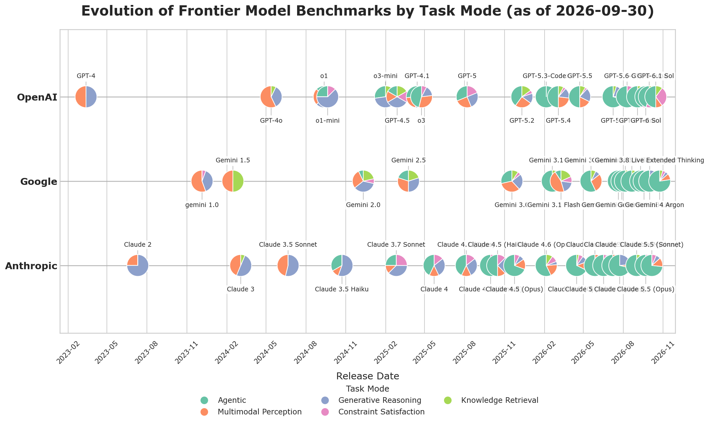
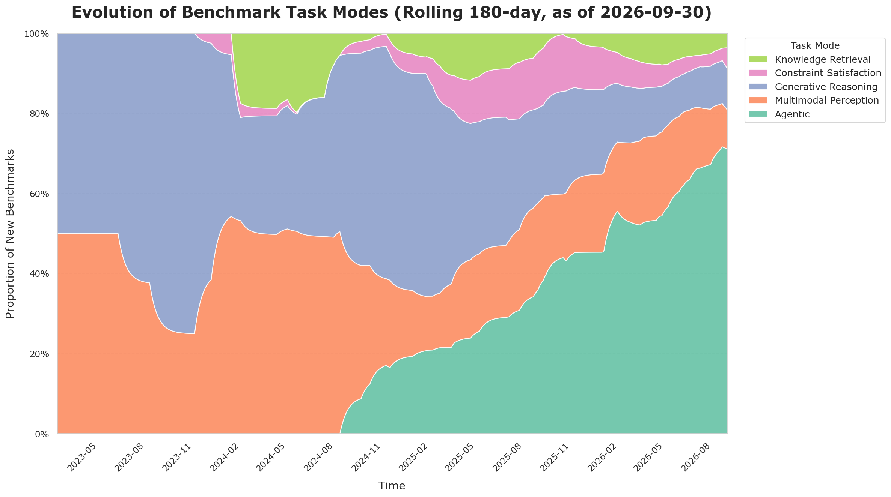

<!-- Generated by analysis/project_overview/analyze.py. Edit README.template.md, then run scripts/run_pipeline.sh. -->
# The Evolution of Benchmarks in Frontier Models

**How the evaluations named in OpenAI, Google, and Anthropic model announcements change over time.**

[](https://github.com/isingmodel/evolution_of_benchmarks_in_frontier_models/actions/workflows/ci.yml)
[](#sample-and-method)
[](LICENSE)

Which kinds of tasks appear in each model's benchmark portfolio? How does that
mix change, which benchmarks become shared reference points, and which return
across later releases? This project connects a visual release history to a
source-linked catalog and reproducible analysis of each benchmark's reporting history.

**59 model rows · 55 distinct announcements · 286 observed benchmark identities · through 2026-09-30**

The evidence is **names appearing on selected public launch pages**: results,
comparisons, footnotes, suite components, and partner quotations all count.
Appearance does not by itself establish a score for the new model, prominence,
or use during training. Release discovery was checked through **October 4, 2026**.

<details>
<summary>Sample coverage by provider</summary>

| Provider | Model rows | Announcements | With benchmarks | First tracked | Latest tracked |
| --- | --- | --- | --- | --- | --- |
| Anthropic | 21 | 21 | 19 | 2023-03-14 | 2026-09-28 |
| Google | 17 | 14 | 14 | 2023-12-06 | 2026-09-30 |
| OpenAI | 21 | 20 | 18 | 2022-11-30 | 2026-09-29 |

The inventory includes selected general-purpose frontier releases and cyber
variants, including restricted launches. It is not an exhaustive model history.

</details>

[Release and type views](#benchmark-types-across-model-releases) ·
[Each benchmark's history](#each-benchmark-has-a-reporting-history) ·
[Data and methods](#sample-and-method) ·
[Reproduce](#reproduce-and-extend)

## Benchmark types across model releases

This view connects **model, provider, release date, and benchmark composition**.
The five colors are a compact task-mode projection of the richer taxonomy:
Agentic, Multimodal Perception, Generative Reasoning, Constraint Satisfaction,
and Knowledge Retrieval.



Every model row is shown; selected names keep the overview readable.
The [fully labeled view](assets/benchmark_evolution_detail.png) identifies every row.
Read the colors as a summary of the tasks represented on each launch page.
These projected categories use provisional facets; “Agentic” is broader than the
explicit tool/environment interaction measure examined below. The
[release-view methods](analysis/benchmark_evolution/README.md) explain the visual
encoding and treatment of missing classifications.

## Benchmark types over time

The trailing **180-day** view brings out changes across release portfolios.
Each benchmark-bearing model row has one unit of weight, split across its
recorded resolved mentions. Repeated benchmark appearances contribute again;
this is composition of reporting, rather than a count of newly invented benchmarks.
Each window normalizes its covered category weight to 100%; windows without
covered observations remain gaps.



The curve is a descriptive taxonomy view. Sparse early releases and the mix of
providers affect it; classification gaps and provisional labels affect the
categories. The [task-mode and domain panels](assets/benchmark_growth_by_all_category.png)
and [multi-facet view](assets/benchmark_facet_trends.png) provide complementary
detail. See [trend methods](analysis/benchmark_taxonomy_trends/README.md) for the
window, denominator, and missing-data rules.

These two views retain **named model rows**, including jointly announced
variants. The sharing and lifecycle analyses below instead count each distinct
announcement once, and the interaction analysis compares both units.

## A small shared set accounts for most reporting

**25.9% of observed benchmark identities appear across providers**. These identities account for **62.1% of benchmark–announcement observations**.
**74 identities** appear at two or more providers;
**38** appear at all three.


Giving each benchmark-bearing announcement one unit, divided across its canonical
benchmark set, shared identities contribute **63.3%** of
the average portfolio. The shared majority persists under equal announcement weighting. Long tables and jointly announced variants therefore do not explain it by themselves.

This result uses catalog identities: explicit versions remain separate, while
some historical rows combine variants. It does not establish benchmark-family
concentration or comparable scoring protocols.
[Counts and both weightings](analysis/project_overview/sharing_summary.csv).

## Each benchmark has a reporting history

**169 identities appear on one announcement.** Of these,
**136 first enter the sample in 2026**.
Recent entries have less time to recur, so a single appearance is not a completed
lifetime. The lifecycle analysis follows first and last sightings, recurrence,
provider spread, and reporting gaps for every catalog identity.


Dots are actual announcement dates; grey spans connect first and last sightings
and can contain gaps. Last seen does not establish retirement, saturation, or
replacement. The [complete catalog report](analysis/benchmark_lifecycle/report.md)
covers **288 identities**, including **2**
unobserved by this cutoff. [Provider histories](analysis/benchmark_lifecycle/provider_lifecycles.csv)
count subsequent launches, including pages with no recorded benchmarks, so gaps
can be read against each provider's release cadence.

### How often does reporting spread to another provider?

The table includes identities that remain provider-specific, admitting each only when
the entire follow-up window fits inside the observed series.

| Follow-up window | Eligible identities | Seen at a second provider within window | Share |
| --- | --- | --- | --- |
| 30 days | 209 | 26 | 12.4% |
| 90 days | 160 | 50 | 31.2% |
| 180 days | 113 | 45 | 39.8% |

Each row has a different eligible cohort. Time starts at the first mention in
this dataset, rather than benchmark publication; an eligible window need not
contain another provider's launch. Follow-up ends at **2026-09-30**.
These are descriptive reporting fractions, not a survival curve or a field-wide
adoption probability.
[Window definitions and evidence](analysis/project_overview/README.md#diffusion-with-complete-calendar-follow-up).

## How much depends on the classification?

The overview also measures explicit interaction with tools or environments.
This narrower measure requires a tool, environment, browser, terminal/codebase,
or computer-control interaction label. Static code generation, unit-test scoring,
and planning alone do not qualify.

With equal weight per benchmark-bearing announcement in **2026**, **64.0%** of portfolio weight carries a tool or environment interaction label. Filtering to labels rated ≥0.70 gives **17.2%**. Under that filter, **36.6%** of portfolio weight has any annotation on the interaction axis; accepted interaction annotations cover **0.0%**.

The difference between all active labels and the rating-filtered view makes
annotation quality part of the result. A confidence rating of at least 0.70 is
a sensitivity filter, **not completed review**. Missing labels retain their
weight in the denominator; zero accepted-label coverage supplies no reviewed
basis for an estimate, rather than evidence that interaction is absent.

<details>
<summary>Interaction trend, annual values, and model-row sensitivity</summary>

The annual share carrying tool or environment interaction labels rises from **0.0% in 2023** to **64.0% in 2026**, using all active labels.


| Year | Announcements | All active labels | Labels rated ≥0.70 | Coverage at ≥0.70 | Accepted-label coverage |
| --- | --- | --- | --- | --- | --- |
| 2023 | 3 | 0.0% | 0.0% | 98.2% | 20.2% |
| 2024 | 8 | 9.7% | 6.6% | 99.1% | 13.6% |
| 2025 | 14 | 35.9% | 32.4% | 99.2% | 0.0% |
| 2026 YTD | 26 | 64.0% | 17.2% | 36.6% | 0.0% |

Positive shares and coverage both use the full announcement-weighted denominator.
Coverage means any retained interaction label, including static tasks.
Changing the unit from announcements to model rows gives
**64.0% versus 64.4%** for the 2026 all-active estimate.
[Provider-level comparisons](analysis/project_overview/provider_interaction_trends.csv)
and [the exact retained labels](analysis/project_overview/interaction_classification.csv)
allow closer inspection. The older [broad software/tool-task proxy](analysis/readme_story/README.md)
also included static coding tests and remains an exploratory comparison.

</details>

## Sample and method

There are **51 benchmark-bearing announcements** and
**745 canonical benchmark–announcement observations**. The
announcement unit is a provider, release date, and normalized source URL;
aliases resolve through exact mappings.
[Annual inventory](analysis/project_overview/annual_inventory.csv) exposes uneven
coverage. [Overview methods](analysis/project_overview/README.md) define the
denominators and reconcile raw labels, model rows, and announcement observations.

Named suites and their components may both appear, so counts are not independent
tests. Some historical labels combine versions, and current launch pages can
have been edited since release. First sightings describe this sample, not
archived proof of when a benchmark entered public use.

The facet table contains **4,052 labels: 36 accepted,
3,956 needing review, and 60 legacy seeds**.
Identity approval and facet approval are separate. The
[preface audit](docs/readme_data_audit_2026_10_04.md) records corrections including
MTOB's task definition and missing mentions, plus unresolved MRCR lineage. The
[release audit](docs/data_refresh_2026_10_04.md) records source-discovery coverage.

## Explore the evidence

| Question | Start here |
| --- | --- |
| What did a launch page name? | [Model inventory and source URLs](data/models.csv) |
| What does a benchmark name refer to? | [Catalog](data/benchmarks.csv), [aliases](data/benchmark_aliases.csv), [distinctness decisions](data/benchmark_distinctness.csv) |
| Where did one benchmark appear? | [Complete lifecycle report](analysis/benchmark_lifecycle/report.md) and [source-linked observations](analysis/benchmark_lifecycle/launch_mentions.csv) |
| How many benchmarks were reported per release? | [Benchmark-count view](assets/benchmark_count_per_release.png) |
| What about long context, attribution, and provider similarity? | [Supporting analyses](analysis/README.md#exploratory-and-supporting-analyses) |
| Which classifications need work? | [Facet data](data/benchmark_facets.csv), [review priorities](analysis/readme_story/review_leverage_top.csv), [review guidelines](docs/facet_review_guidelines.md) |

Further progress depends on reviewing influential provisional labels, documenting
benchmark-family and implementation lineage, and recording whether each mention
is a direct result, comparison, component, or quotation. The
[current synthesis](analysis/SYNTHESIS.md) separates supported findings from
these open research questions; earlier analyses remain available for comparison.

## Reproduce and extend

Python **3.10–3.14** is tested in CI. From the repository root:

```bash
python3 -m venv .venv
.venv/bin/python -m pip install -r requirements.txt -e .
.venv/bin/python -m unittest discover -s tests
bash scripts/run_pipeline.sh
```

The pipeline rebuilds tables, figures, and this README from committed inputs;
no model API credentials are needed. The cutoff defaults to the latest release
date; set `AS_OF=YYYY-MM-DD` to select another. CI checks deterministic text
outputs; PNG bytes can vary with fonts.

To extend the data, follow the [extraction and review workflow](docs/release_page_extraction_workflow.md)
and [data guide](data/README.md). Edit the preface in
[README.template.md](analysis/project_overview/README.template.md); its counts
and evidence tables are generated. Taxonomy reclassification is a separate
[authoring step](docs/benchmark_classification_prompt.md) whose current client
also depends on maintainer-local tooling.

## License

Repository data, code, and documentation use [Apache 2.0](LICENSE).
Linked benchmark materials and source pages retain their own terms.
