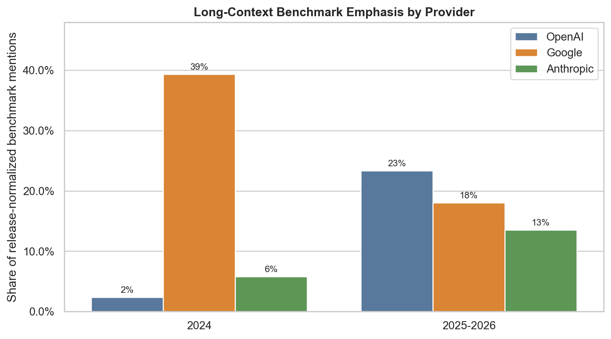
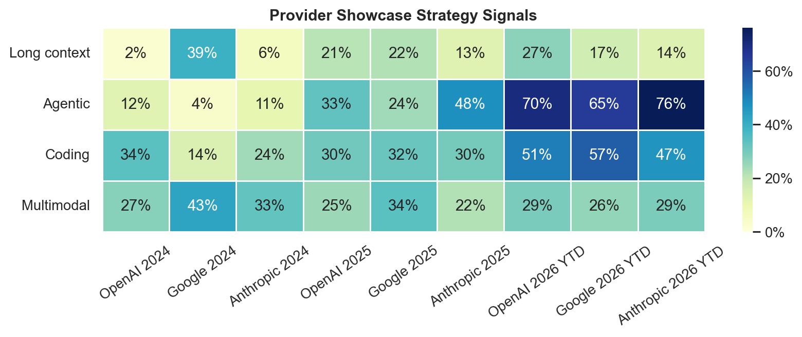

# Provider Strategy: Long-Context Showcase

This analysis concretizes idea #2: providers may differ in how they showcase
benchmarks over time, and Gemini/Google in 2024 may have emphasized
long-context benchmarks because long context was a differentiating release-page
theme versus OpenAI and Anthropic. The quantitative claim here is only about
benchmark mentions on public release pages, not about model capability or
provider intent.

Run from the repo root:

```bash
.venv/bin/python analysis/provider_strategy_long_context/analyze.py
```

The current run uses local data through `2026-07-24`, resolves 557 benchmark
mentions, and has 0 unresolved mentions.

## Metrics

Primary shares are release-normalized: each benchmark-bearing release page
contributes 1.0 total weight, divided evenly across the resolved benchmarks on
that page. This keeps long benchmark tables from dominating the provider-period
comparison. Raw mention counts and raw long-context shares are also written to
the CSVs.

- Long context: `context_pressure` is `long_context_primary` or
  `long_context_supporting`; primary-only share is reported separately.
- Agentic: headline mode is `Agentic`, or the construct/interaction facets
  indicate tool use, web/computer use, environment interaction, or multi-step
  agent behavior.
- Multimodal: modality uses image, video, audio, document layout, mixed
  multimodal, browser UI, or desktop UI.
- Coding: coding domain, code modality, coding/software-engineering construct,
  or coding-oriented task mechanism.
- Axis tables split a benchmark's weight evenly when a benchmark has multiple
  active labels within the same facet axis.

## Strongest Findings

The 2024 data strongly supports the descriptive part of the hypothesis.
Google/Gemini has a much larger long-context benchmark share than OpenAI or
Anthropic in 2024:

| Provider | Period | Long-context share | Agentic share | Coding share | Multimodal share |
| --- | --- | ---: | ---: | ---: | ---: |
| OpenAI | 2024 | 2.4% | 12.5% | 33.9% | 27.4% |
| Google | 2024 | 39.3% | 3.6% | 14.3% | 42.9% |
| Anthropic | 2024 | 5.8% | 11.1% | 24.1% | 32.7% |
| OpenAI | 2025-2026 | 23.3% | 47.9% | 38.6% | 26.6% |
| Google | 2025-2026 | 18.0% | 54.7% | 50.5% | 28.1% |
| Anthropic | 2025-2026 | 13.5% | 61.8% | 38.2% | 25.3% |

The gap narrows after 2024 and OpenAI has the highest combined 2025-2026
long-context share. In 2026 YTD the broad shares are 27.0% for OpenAI, 16.7%
for Google, and 13.6% for Anthropic. The broader 2025-2026 story shifts toward
agentic and coding showcases across all three providers.

The main 2024 Google long-context driver is `Needle In A Haystack` on Gemini
1.5, which alone contributes 25.0% of Google's release-normalized 2024
benchmark emphasis. Gemini 2.0 adds smaller supporting signals through `MRCR`
and `EgoSchema`. OpenAI's 2024 long-context signal is only `EgoSchema` on
GPT-4o, and Anthropic's is only `Needle In A Haystack` on Claude 3.

In 2025-2026, Google's largest broad long-context drivers include `MRCR v2`,
`SWE-bench Pro`, `SWE-bench verified`, `MRCR`, and `FACTS Benchmark suite`.
OpenAI's include `SWE-bench verified`, `SWE-bench Pro`, `GDPval`,
`GraphWalks`, and `SWE-Lancer`. Anthropic's are led by `SWE-bench verified`,
`SWE-bench Pro`, and `SWE-bench Multilingual`. This broad operationalization
therefore captures supporting-context work benchmarks as well as pure
long-context retrieval.

The coding/agentic transition is visible in the period summaries and drivers.
In 2025-2026, Anthropic is the most agentic provider by benchmark-showcase
share, driven by `SWE-bench verified`, `Terminal-bench`, `Tau-bench`, `OSWorld`,
and `TAU-2 bench`. OpenAI also moves sharply in 2026 YTD, with high agentic and
coding shares around SWE, terminal, OSWorld, BrowseComp, and tool-use benchmarks.

## Charts And Tables





Generated outputs:

- `provider_hypothesis_period_summary.csv`: direct 2024 versus 2025-2026 test.
- `provider_period_summary.csv`: non-overlapping provider-period strategy table.
- `provider_hypothesis_axis_shares.csv`: facet-axis distributions for the direct
  hypothesis periods.
- `provider_period_axis_shares.csv`: facet-axis distributions for 2022-2023,
  2024, 2025, and 2026 YTD.
- `long_context_benchmark_drivers.csv`: benchmark-level long-context drivers.
- `benchmark_drivers.csv`: all benchmark-level provider-period drivers with
  long-context, agentic, multimodal, and coding flags.
- `release_benchmark_mentions.csv`: mention-level resolved data.
- `facet_review_status_summary.csv`: review status mix for facet rows.
- `unresolved_mentions.csv`: currently header-only because all mentions resolve.

## Limitations

This supports a release-page showcase pattern, not a causal claim about why
Google highlighted long context or whether one model was objectively better.
Provider intent and competitive differentiation would need page prose, launch
context, and external positioning evidence.

Facet review debt is material. For `context_pressure`, 206 of 208 facet rows are
`needs_review`; only 2 are `accepted`. Domain and headline task mode also mix
accepted rows with legacy seeds. Treat the shares as operationalized indicators
from the current taxonomy, not final ground truth.

The broad long-context metric includes supporting-context benchmarks such as
`EgoSchema`, `FACTS Benchmark suite`, and `GDPval`, not only pure long-context
retrieval tests. Use `long_context_primary_share` in the CSVs for the stricter
view.

Empty benchmark release pages are counted in `release_count` but do not
contribute to the share denominator. This is intentional because the analysis is
about the composition of named benchmark mentions when a page includes them.

## Follow-Up Analyses

- Manually review `context_pressure` for MRCR, EgoSchema, FACTS, GDPval, and
  other supporting-context labels before treating small differences as robust.
- Add release-page prose features such as "context window", token counts,
  headline placement, chart placement, and benchmark-table ordering.
- Split provider-created or private evaluations from external benchmarks to see
  whether showcase strategy increasingly depends on proprietary evals.
- Compare release-normalized shares with raw mention shares and page-level
  prominence weights.
