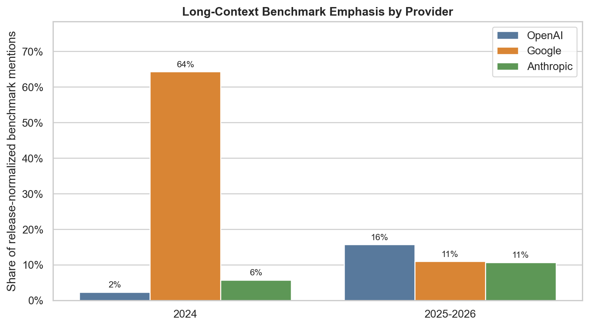
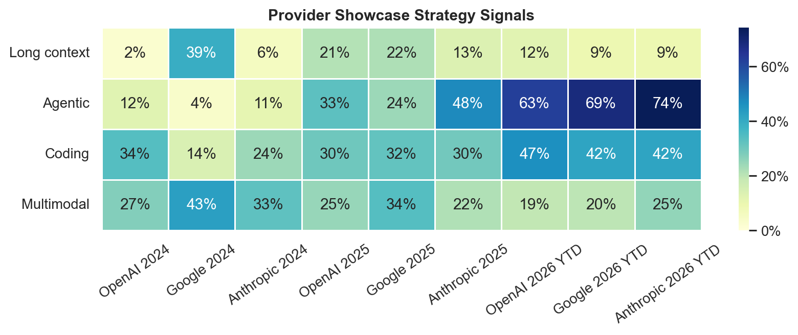

# Provider Strategy: Long-Context Showcase

This analysis concretizes idea #2: providers may differ in how they showcase
benchmarks over time, and Gemini/Google in 2024 may have emphasized
long-context benchmarks because long context was a differentiating release-page
theme versus OpenAI and Anthropic. The quantitative claim here is only about
benchmark mentions on public release pages, not about model capability or
provider intent.

Run from the repo root:

```bash
.venv/bin/python analysis/provider_strategy_long_context/analyze.py
```

The current run uses local data through `2026-09-30`, resolves 791 raw benchmark
mentions, and has 0 unresolved mentions. The weighted unit is a benchmark-bearing model-release row; a shared launch URL can supply several rows.

## Metrics

Primary shares are release-normalized: each benchmark-bearing model-release row
contributes 1.0 total weight, divided evenly across the resolved benchmarks on
that page. This keeps long benchmark tables from dominating the provider-period
comparison. Raw mention counts and raw long-context shares are also written to
the CSVs.

- Long context: `context_pressure` is `long_context_primary` or
  `long_context_supporting`; primary-only share is reported separately.
- Agentic: headline mode is `Agentic`, or the construct/interaction facets
  indicate tool use, web/computer use, environment interaction, or multi-step
  agent behavior.
- Multimodal: modality uses image, video, audio, document layout, mixed
  multimodal, browser UI, or desktop UI.
- Coding: coding domain, code modality, coding/software-engineering construct,
  or coding-oriented task mechanism.
- Axis tables split a benchmark's weight evenly when a benchmark has multiple
  active labels within the same facet axis.

## Current Findings

Release-normalized shares through `2026-09-30`, from `provider_hypothesis_period_summary.csv`:

| Provider | Period | Long-context share | Agentic share | Coding share | Multimodal share |
| --- | --- | ---: | ---: | ---: | ---: |
| OpenAI | 2024 | 2.4% | 12.5% | 33.9% | 27.4% |
| Google | 2024 | 39.3% | 3.6% | 14.3% | 42.9% |
| Anthropic | 2024 | 5.8% | 11.1% | 24.1% | 32.7% |
| OpenAI | 2025-2026 | 15.7% | 50.1% | 40.1% | 21.4% |
| Google | 2025-2026 | 11.0% | 62.3% | 40.3% | 21.8% |
| Anthropic | 2025-2026 | 10.8% | 63.6% | 36.9% | 23.8% |

The Google 2024 result is a bounded case study based on two benchmark-bearing releases. `Needle In A Haystack` on Gemini 1.5 contributes 25 percentage points to Google's 39.3% broad share. The primary-only measure and current drivers are available in the period summary and `long_context_benchmark_drivers.csv`.

The 2025-2026 long-context gap is smaller, and agentic/coding shares rise across providers. For 2026 YTD through September 30, broad long-context shares are 12.3% for OpenAI, 9.2% for Google, 9.1% for Anthropic. The broad measure includes supporting-context work benchmarks; it is not restricted to retrieval tests. Use the primary-only column for that stricter comparison.

## Charts And Tables





Generated outputs:

- `provider_hypothesis_period_summary.csv`: direct 2024 versus 2025-2026 test.
- `provider_period_summary.csv`: non-overlapping provider-period strategy table.
- `provider_hypothesis_axis_shares.csv`: facet-axis distributions for the direct
  hypothesis periods.
- `provider_period_axis_shares.csv`: facet-axis distributions for 2022-2023,
  2024, 2025, and 2026 YTD.
- `long_context_benchmark_drivers.csv`: benchmark-level long-context drivers.
- `benchmark_drivers.csv`: all benchmark-level provider-period drivers with
  long-context, agentic, multimodal, and coding flags.
- `release_benchmark_mentions.csv`: mention-level resolved data.
- `facet_review_status_summary.csv`: review status mix for facet rows.
- `unresolved_mentions.csv`: currently header-only because all mentions resolve.

## Limitations

This supports a release-page showcase pattern, not a causal claim about why
Google highlighted long context or whether one model was objectively better.
Provider intent and competitive differentiation would need page prose, launch
context, and external positioning evidence.

Facet review debt is material. For `context_pressure`, 296 of 298 facet rows are
`needs_review`; only 2 are `accepted`. Domain and headline task mode also mix
accepted rows with legacy seeds. Treat the shares as operationalized indicators
from the current taxonomy, not final ground truth.

The broad long-context metric includes supporting-context benchmarks such as
`EgoSchema`, `FACTS Benchmark suite`, and `GDPval`, not only pure long-context
retrieval tests. Use `long_context_primary_share` in the CSVs for the stricter
view.

Model-release rows without benchmarks are counted in `release_count` but do not
contribute to the share denominator. This is intentional because the analysis is
about the composition of named benchmark mentions when a page includes them.

## Follow-Up Analyses

- Manually review `context_pressure` for MRCR, EgoSchema, FACTS, GDPval, and
  other supporting-context labels before treating small differences as robust.
- Add release-page prose features such as "context window", token counts,
  headline placement, chart placement, and benchmark-table ordering.
- Split provider-created or private evaluations from external benchmarks to see
  whether showcase strategy increasingly depends on proprietary evals.
- Compare release-normalized shares with raw mention shares and page-level
  prominence weights.
